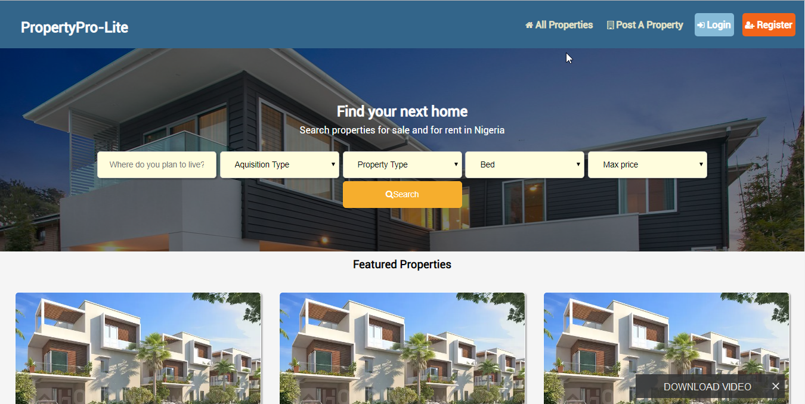

    

# PropertyLite

## Table of Contents

 - [Introduction](#introduction)
 - [Installing](#installing)
 - [Working Routes](#working-routes)

 # Introduction

### Project Overview

**PropertyLite** is a 
Property Pro Lite is a platform where people can create and/or search properties for sale or rent.

To get started with this project you need a basic knowledge of :

[Javascript(ES6)](https://es6.io/)

- ### __Style guide__

[Airbnb ](https://github.com/airbnb/javascript)(Javascript style guide)

- ### Useful Links
## Screenshot(UI template)

Preview UI templates : [Github Pages](https://ldonjibson.github.io/propertypro--lite/)

View Project Management: [Pivotal Tracker](https://www.pivotaltracker.com/n/projects/2355063)

Hosted on Heroku: [Heroku](https://propertypro--lite.herokuapp.com/api/v1)

API Documentation: [Swagger](https://propertypro--lite.herokuapp.com/swagger)

- ### Technology Stack
1. HTML & CSS
2. Javascript

## Required Features

1. `User can sign up.`
2. `User can sign in.`
3. `User (agent) can post a property advert`
4. `User (agent) can update detail of a property advert.`
5. `User (agent) can mark his/her posted advert as sold.`
6. `User (agent) can delete a property advert.`
7. `User can view all properties adverts.`
8. `User can view all properties of a specific type - 2 bedroom, 3 bedroom, mini flat etc.`
9. `User can view a specific property advert.`

# Installing

#### Prerequisites

Ensure you have **NodeJS** installed by entering `node -v` on your terminal.
If you don't have **NodeJS** installed, go to the [NodeJS Website](http://nodejs.org),  and follow the download instructions

To install this app

- `
git clone https://github.com/ldonjibson/propertypro--lite.git
`

- To  install all the required dependencies, on your terminal run

`npm install` 

- To run server,

`npm run start   or npm start`

- Server listens on port `3001`

## Running the tests

- To run test cases

`
npm run test
`
# Working Routes

 ## *API Endpoints*
|Endpoint                                           | Functionality                     |HTTP method 
|---------------------------------------------------|:-----------------------------------:|-------------:
|/api/v1/                                |Welcome to Propertypro--lite API        |GET
|/api/v1/auth/signup                               |Sign up a new user         |POST
|/api/v1/auth/signin                               |Sign in an existing user        |POST 
|/api/v1/property                               |Agent can post a property advert        |POST 
|/api/v1/property/*property-id*                    |Agent can edit posted property advert |PATCH
|/api/v1/property/*property-id*                    |Agent can delete posted property advert |DELETE
|/api/v1/property/*property-id*/sold                    |Agent can update the status posted property advert to sold |PATCH
|/api/v1/property                    |Get all  property advert |GET
|/api/v1/property/?type=*propertyType*                    |Get all property advertisement offering a specific type of property. |GET
|/api/v1/property/*property-id*                    |View a specific property advert. |GET

## Acknowledgments :

- [Andela Home Study](https://homestudy.andela.com/)
- [Google Search](https://google.com)
- [w3schools](https://www.w3schools.com/)
- [MDN](https://developer.mozilla.org/en-US/)
- [Stackoverflow](stackoverflow.com)
